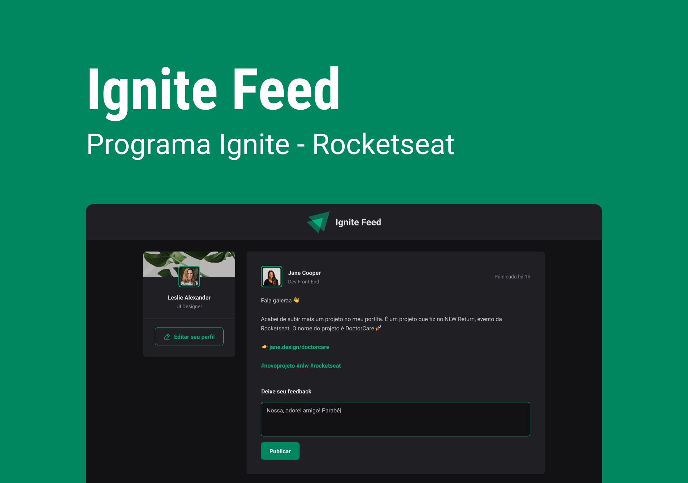

<div align="center">
    

#  IGNITE FEED

Ignite Feed é um projeto desenvolvido durante o bootcamp Ignite da Rocketseat. Este projeto é uma aplicação de feed de posts que permite aos usuários visualizar e interagir com postagens.




</div>

## Índice

- [Pré-requisitos](#pré-requisitos)
- [Instalação](#instalação)
- [Configuração](#configuração)
- [Executando o Projeto](#executando-o-projeto)
- [Tecnologias Utilizadas](#tecnologias-utilizadas)

## Pré-requisitos

Antes de começar, certifique-se de ter os seguintes requisitos atendidos:

- Node.js (versão 14.x ou superior)
- npm (versão 6.x ou superior) ou yarn (versão 1.x ou superior)
- Git

## Instalação

1. **Clone o repositório:**

   ```bash
   git clone https://github.com/WangleyVieira/AppIgniteFeed.git
   cd ignite-feed 
   ```
2. **Instale as dependências**

   Usando npm:
    ```bash
    npm install
   ```
   Ou usando yarn:
    ```bash
    yarn install
   ```

## Configuração
No momento, este projeto não requer configuração adicional. No entanto, você pode ajustar configurações específicas no arquivo .env se necessário.

## Executando o Projeto
Para iniciar o servidor de desenvolvimento, utilize o seguinte comando:

Usando npm:
```bash
npm run dev
```

Ou usando yarn:
```bash
yarn dev
```

O projeto estará disponível no endereço http://localhost:5173

## Tecnologias Utilizadas
- React
- Vite
- JavaScript
- Styled Components